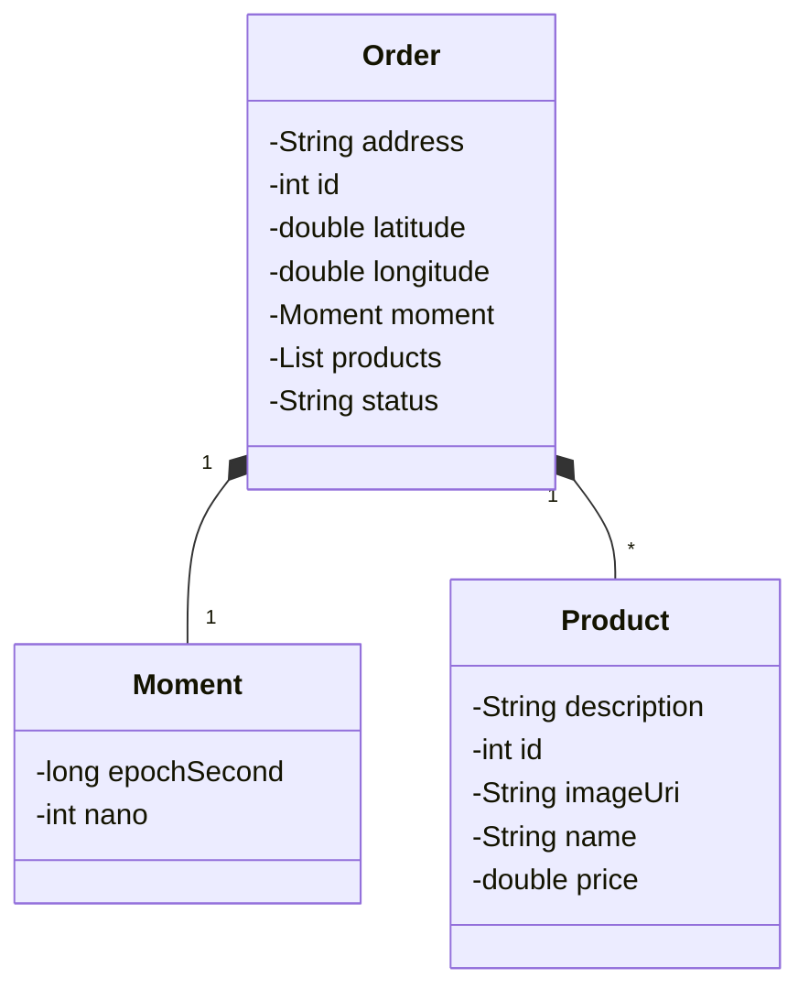

# documentação da api: 
[https://wesley-sds2.herokuapp.com/swagger-ui.html](https://ds-deliver-backend-4b04bda63579.herokuapp.com/swagger-ui.html)

App de restaurante delivery

app: https://dsdelivery-wes.netlify.app/

